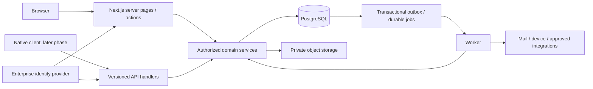

# Architecture

Status: proposed implementation baseline · Owner: Engineering Lead · Updated: 2026-09-28

## Deployment shape

Start with a TypeScript modular monolith: Next.js web/API deployment, a separately runnable worker using the same domain packages, self-hosted PostgreSQL community, private SeaweedFS OSS storage, and Keycloak community identity. Use Drizzle/pg repositories and pg-boss plus transactional outbox for durable jobs. Operate on company-controlled Linux with Podman/Caddy; Forgejo/Runner supplies CI. No managed-cloud or paid-service dependency is required. Resource capacity, location, staffing and disaster-recovery topology remain discovery decisions. Exact packages/services are in [tech stack](tech-stack.md); [free resources](free-resources.md) records licenses and the required Iconsax provenance check.



The same deployment hosts domain boundaries, not one generic service with unrestricted table access. Domains own their write models. Payroll consumes snapshots of approved inputs, never mutable live UI totals. Shared services are identity, authorization, audit, workflow, documents, notifications, and jobs.

## Directory contract

```text
app/
  layout.tsx                 # static shell and providers; no employee reads
  loading.tsx
  error.tsx
  global-error.tsx
  (public)/login/page.tsx
  (workspace)/dashboard/{page,loading,error}.tsx
  (workspace)/employees/{page,loading,error}.tsx
  (workspace)/employees/[employeeId]/{page,loading,error}.tsx
  (workspace)/attendance/{page,loading,error}.tsx
  (workspace)/leave/{page,loading,error}.tsx
  (workspace)/payroll/{page,loading,error}.tsx
  (workspace)/me/payslips/{page,loading,error}.tsx
  api/v1/                    # native/integration endpoints
components/
  sections/                  # layout with resolved typed props
  ui/                        # stateless primitives and skeleton primitives
  features/                  # client interaction islands
lib/
  api/                       # server-only read facades
  actions/                   # authorized server commands
  server/{auth,domains,repositories,jobs,audit}/
  validation/                # runtime boundary schemas
  utils/                     # pure formatting / reusable helpers
types/                       # DTOs and domain type contracts
workers/                     # job entrypoints; no UI imports
tests/{unit,integration,contract,e2e,performance}/
system/brain/                # this specification
```

Braced filenames illustrate required siblings, not literal filenames. Other data-bearing routes follow the same loading/error convention. Create feature folders when used, not empty abstractions in advance.

## Server rendering without violating page-owned fetching

1. The page exports static metadata and composes section components and explicit Suspense boundaries only.
2. Each boundary wraps an async **route-local data helper declared in that page file**. The helper initiates authorized reads through `lib/api`, validates route/search parameters, awaits its own required data, and returns a section with resolved props.
3. Fetch independent resources concurrently inside the helper. Where useful, independent page helpers stream independently. A request-scoped loader avoids duplicate reads shared by several helpers.
4. Sections own layout; UI owns presentation. Neither imports an adapter, repository, or fetch API. A helper's JSX only hands data to a section; it contains no grids, conditionally rendered product UI, sorting, or policy logic.
5. `loading.tsx` covers route-level suspension; explicit boundaries allow independent regions to stream. Do not await all data above all boundaries and claim granular streaming.
6. The workspace shell remains generic until an authorized page section renders role-specific navigation. Do not serialize protected shell details before authorization. Identity checks in data adapters/services are mandatory on every read.

This is a project-specific organization of server data fetching and Suspense. The framework supports route loading boundaries and finer-grained Suspense boundaries. [Next.js fetching and streaming](https://nextjs.org/docs/app/getting-started/fetching-data)

## Reads, commands, and caches

`lib/api` exposes typed query facades over the domain query API. In-process server reads may call that query API directly to avoid self-HTTP; remote integrations use transport adapters. Both return the same DTOs. The term API is a domain contract, not a requirement for a loopback network request.

Client feature forms receive server action references through route composition. Actions parse input, obtain identity from the session, verify scope, execute a command, and return a discriminated result. On success, invalidate only the affected route/data view and render the authoritative result. No optimistic payroll publication, approval result, or leave balance commitment.

API handlers reuse the same commands; never duplicate rules for native clients. They validate bearer/cookie credentials according to [API contract](api-contract.md). UI visibility is not enforcement. Central authorization and reduced DTOs follow the framework's documented DAL guidance. [Next.js authentication](https://nextjs.org/docs/app/guides/authentication)

Private HR responses, server actions, document proxies, React server payloads, and authenticated error responses must not enter shared CDN/browser/service-worker caches. Use explicit `private, no-store` semantics on applicable responses and verify deployment behavior. Request-local memoization includes actor/scope context; no process-global memo of private results. Only public immutable assets are cacheable by default.

## Transactions and asynchronous work

Within one transaction, a command writes domain state, audit event, and outbox event. Publishing to a provider happens after commit. Workers claim jobs using transactional leases, renew leases for long operations, and recover expired leases. At-least-once delivery is expected; consumer uniqueness keys prevent repeated side effects.

Use optimistic `version` checks on employee/policy edits; row locks and unique constraints on leave reservations and payroll period transitions. Retry serialization/deadlock conflicts with bounded backoff only when the entire operation is idempotent. Never hold a DB transaction across email, object scanning, or provider network calls.

Payroll, import validation, reports, PDF rendering, and virus scans are jobs with status, counts, progress checkpoint, and failure reason. A failed job cannot make partial artifacts visible as completed. Batch payroll calculations into staging rows; atomically mark a complete verified run ready for review.

## Availability, scale, and observability

Stateless web replicas scale horizontally. Start with indexed relational queries and server pagination; introduce partitioning only after volume evidence. Workers have separate queues/concurrency for attendance, payroll, scans, reports, and mail so payroll cannot starve attendance. Cap report query duration and rows. Read replicas are optional for noncritical analytics with visible freshness; approval/balance/payment reads use authoritative storage.

Emit structured redacted logs, request and job correlation IDs, latency/error/queue metrics, and distributed traces excluding HR content. Health endpoints distinguish liveness from readiness. Document exact topology and cost before provisioning. [Operations](operations.md) owns SLOs, restore, and incident controls.

## Evolution boundaries

Select supported stable framework/runtime versions during scaffold, lock dependencies, and record them in an ADR. No experimental framework features are needed. Native apps reuse DTO/schema packages where suitable, not web components. Split a domain into a service only for demonstrated independent scale, ownership, or isolation needs; preserve the versioned contract and transaction guarantees.

Frontend/backend contracts and aligned tasks are in [frontend/backend alignment](frontend-backend-alignment.md). [State management](state-management.md) keeps domain state on the server and local interactions in React feature controllers; no global client data store is required. [Roles and permissions](roles-permissions.md) owns typed capability names and scope rules. Infrastructure substitutions must preserve the free/open-source/no-required-subscription constraint.
