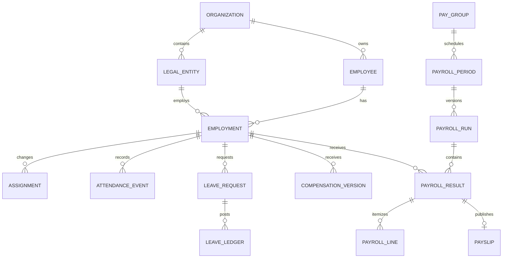

# Data model

Status: logical schema specification · Owner: Backend Lead + Data Owner · Updated: 2026-09-28

## Shared conventions

PostgreSQL is the proposed system of record. Use opaque UUID identifiers, UTC `timestamptz` for instants, `date` for business dates, and an IANA timezone for interpretation. Money uses `numeric(19,4)` internally, currency-specific settlement precision, and decimal-string API representations. Rates use exact decimals; attendance uses integer minutes; fractional leave uses `numeric(8,4)`.

All organization-owned rows include `organization_id`. Composite foreign keys `(organization_id, parent_id)` prevent cross-organization references even when an application query is wrong. Use `(organization_id, id)` unique keys, explicit query scope, and PostgreSQL row-level security as defense in depth. Request/worker transactions set tenant context locally; pooled connections must never retain session-scoped tenant context. The application role cannot bypass RLS; migrations use a separate audited role.

Mutable records carry `created_at`, `created_by`, `updated_at`, and integer `version`. Effective-dated histories carry `valid_from`, exclusive `valid_to` (nullable), and recorded timestamps. Use database overlap constraints for mutually exclusive assignments. Financial history and ledgers do not use destructive updates or blanket cascade deletes.

## Core relationships

The diagram shows primary business relationships. The tables below define the supporting relations required before implementation.

## Identity and organization

| Entity | Important fields / references | Constraints |
| --- | --- | --- |
| organization | id, code, name, default_timezone, default_currency | Unique code; initial GTF record requires verified legal display details |
| legal_entity | organization_id, legal_name, registration_refs, status | Registration data restricted; location is not automatically a legal entity |
| location | legal_entity_id, code, timezone, calendar_id, address | Unique code per organization; no website-derived payroll jurisdiction without review |
| department / designation / cost_center | code, name, effective dates | Referenced records retired rather than deleted |
| user_account | identity_provider, provider_subject, state | Unique provider+subject; login identity independent of employee code |
| membership | user_id, organization_id, valid dates, status | One active membership per account/organization |
| role / permission / role_permission | explicit capability keys | Versioned permission seed, deny by default |
| role_assignment | membership_id, role_id, scope_kind, scope_id, validity | Valid scope parent; no uncontrolled wildcard claims |
| delegation | delegator, delegate, workflow types, dates, reason | No self-delegation, cycles, or broader rights than delegator |
| session / service_principal | subject, expiry, revocation, key reference | Store token hashes/references, never raw bearer credentials |

## Employee and lifecycle

| Entity | Important fields / references | Constraints |
| --- | --- | --- |
| employee | organization_id, employee_code, display_name, legal_name, private_profile_ref | Unique organization+employee_code; code not reused |
| employee_user_link | employee_id, membership_id | At most one active ESS link per employee; audited merge process |
| employment | employee_id, legal_entity_id, start_date, end_date, status, employment_type | Inclusive last employment date; validate start≤end; concurrent employment requires explicit policy |
| assignment | employment_id, department_id, designation_id, location_id, manager_employment_id, cost_center_id, valid dates | No overlapping primary assignments; no manager cycles/self-manager |
| private_profile | employee_id, contacts, birth_date, emergency_contact | Restricted field DTO; directory never joins unrestricted row |
| bank_account_version | employee_id, encrypted_account, routing_code, verified_at, validity | Masked display; bank changes independently verified |
| statutory_profile | employment_id, encrypted identifiers, scheme eligibility, effective dates | Minimize collection; duplicate detection using protected keyed fingerprints |
| document / document_version | owner_ref, classification, object_key, checksum, mime, size, scan_state, retention_policy_id | Immutable versions; download only after clean scan and permission check |
| lifecycle_case / lifecycle_task | employment_id, type, owner, due_date, blockers, state | State transitions audited; exit does not delete employee |
| asset / asset_assignment | asset_code, employment_id, assigned_at, returned_at | No overlapping active custody; return evidence |

## Attendance, leave, workflow

| Entity | Important fields / references | Constraints |
| --- | --- | --- |
| calendar / holiday | jurisdiction, date, category, version | Versioned assignment; employee calendar derived from employment policy |
| shift / shift_assignment | local_start, local_end, crosses_midnight, breaks, timezone, policy_version | No inferred 24-hour shift; explicit overnight flag |
| attendance_source | source_type, integration_id, verification method | Active source allowlist |
| attendance_event | employment_id, occurred_at, received_at, source_id, source_event_id, direction, quality_flags | Unique organization+source+source_event_id; raw event immutable |
| attendance_day | employment_id, business_date, shift_version, computed_minutes, exceptions, calculation_version | Unique employment+business_date+calculation_version; one current projection |
| regularization_request | original_events/day, proposed_times, reason, workflow_instance_id | No raw-event overwrite; approved correction linked to recalculation |
| leave_type / leave_policy_version | units, eligibility, accrual, carry_forward, expiry, calendar treatment | Effective dates; approved versions immutable |
| leave_account | employment_id, leave_type_id, policy_year | Unique employment+type+year; lock for reservation updates |
| leave_request / leave_request_day | account_id, dates, exact_units, state, workflow_instance_id | Day-level overlap validation across leave types and half-days |
| leave_ledger | account_id, request_id, entry_type, available_delta, reserved_delta, reference_id | Append-only; unique posting key; reversals reference original entry |
| workflow_definition_version | steps, eligibility, escalation, delegation, state schema | Approved immutable version; new versions do not rewrite active instances |
| workflow_instance / step / decision | subject_type/id, definition_version, actor, reason, state, decided_at | One terminal decision per active step; actor differs from requestor |

Leave ledger convention: accrual `(+units,0)`; reservation `(-units,+units)`; approval `(0,-units)`; rejection/cancellation before approval `(+units,-units)`; approved cancellation `(+units,0)` only after approved reversal. Available balance is the sum of available deltas; pending reservation is the sum of reserved deltas. Used amount is derived from approved consumptions less reversals. The service locks account rows, validates nonnegative limits/policy exceptions, posts entries, and advances workflow in one transaction.

Attendance belongs to the shift's business date, including overnight events. No chronological assumption about receipt order; late events trigger projection review. Closed payroll references a frozen attendance snapshot and cannot silently absorb late changes.

## Compensation and payroll

| Entity | Important fields / references | Constraints |
| --- | --- | --- |
| pay_group | legal_entity_id, frequency, currency, cut_off_policy | One legal entity/currency per group |
| pay_group_membership | employment_id, pay_group_id, valid dates | No overlapping primary memberships |
| salary_component / salary_structure_version | code, earning/deduction/employer-cost, base expression, rounding | Typed safe expression grammar; dependency cycle rejection |
| compensation_version | employment_id, structure_version, amounts, valid dates, approval_ref | No overlap; preserve retroactive record time |
| statutory_rule_version | jurisdiction, scheme, effective period, source_ref, formula, reviewer | Publish only with review and official source/effective-date evidence |
| payroll_period | pay_group_id, starts_on, ends_on, payment_date, state | Unique group+period; no duplicate active regular run |
| payroll_run | period_id, revision, kind, state, input_snapshot_id, rule_snapshot_id, checksum | Unique period+revision; validated transitions; correction links original |
| payroll_input_snapshot | employment refs, attendance/leave/compensation versions, adjustments, digest | Immutable once calculation starts |
| payroll_result | run_id, employment_id, gross, deductions, net, employer_cost | Unique run+employment; exact balancing invariants |
| payroll_line | result_id, component_code, quantity, rate, amount, basis_trace | Employee deduction distinct from employer contribution |
| payroll_approval | run_id, actor_id, approved_digest, timestamp | Approval invalidated if digest changes; creator cannot approve |
| payslip | result_id, artifact_version, object_key, state, published_at | Unique published artifact version; only approved run may publish |
| payment_batch / payment_item | run_id, export_digest, result_id, external_reference, state | Unique settlement intent; exported does not mean paid |
| payroll_adjustment | original_result_id, target_period_id, reason, amount, approval | Append-only reconciliation reference; no hidden edits |

Net pay equals settled earnings minus employee deductions under the approved rounding method. Employer contributions remain separate. Final settlement has a distinct run kind and includes policy-approved recoveries/leave settlement; do not repurpose attendance penalties as arbitrary deductions.

## Supporting domains

`helpdesk_ticket`, `ticket_message`, and `ticket_category` apply per-category confidentiality and attachments. `expense_claim`, `expense_item`, `expense_approval`, and `reimbursement` link to one settlement path. `announcement` and `audience_rule` include publication/expiry dates. `candidate`, `application`, `offer`, and `candidate_document` have separate access and retention. `performance_cycle`, `goal`, `review`, and `feedback_release` separate draft feedback from published outcomes. `report_job` and `export_artifact` retain owner, authorized scope, filter snapshot, expiry, and download audit.

Platform records: `audit_event` (append-only), `outbox_event`, `job`, `job_attempt`, `idempotency_record`, `integration`, `webhook_delivery`, `notification`, `import_job`, `import_row`, `source_record_mapping`, `retention_policy`, `legal_hold`, and `deletion_request`. For idempotency store actor+organization+route+key, request digest, state, response reference, and expiry.

## Index and retention strategy

Index employee directory by organization/status/name/id; team assignments by organization/manager/validity; attendance by organization/employment/occurred_at; leave by account/date/state; workflow by assignee/state/due; payroll by period/state and run/employment. Use stable cursor ordering with an ID tie-breaker. Inspect query plans using production-shaped synthetic data before adding indexes or partitions.

Retention depends on record class, statutory obligations, contract, and legal hold. HR/Privacy/Finance must approve a retention register before production. Avoid assigning one invented number of years to every table. Deletion removes eligible object versions, derivatives, search projections, and caches; backup expiry and restoration replay rules are documented separately. Financial/audit records retain only the minimal legally justified data. See [security](security.md) and [operations](operations.md).
