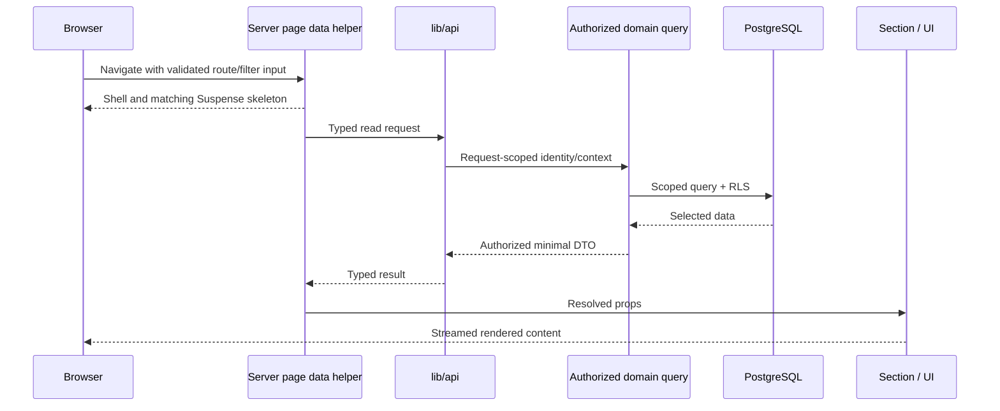

# Frontend and backend task alignment

Status: implementation contract · Owners: Frontend Lead + Backend Lead + QA · Updated: 2026-09-28

## Ownership and stack split

The frontend and backend are distinct responsibilities in one modular TypeScript codebase. Next.js hosts server pages, actions and versioned API routes. Domain services/repositories execute server-side; a separate worker handles slow/durable jobs. Do not create a second REST server simply to make the diagram look separated.

| Area | Frontend owner | Backend owner | Shared contract |
| --- | --- | --- | --- |
| Libraries | Next.js/React, Tailwind, selected Radix primitives, Iconsax adapter | Node.js, Zod, Drizzle/pg, openid-client, pg-boss, decimal.js, Pino | DTO/schema versions, exact errors, capability keys |
| UI | Sections, stateless primitives, minimal feature controllers | No layout, browser or component logic | View-model shape and all loading/empty/error states |
| Reads | Page validates route input and calls `lib/api`; passes resolved props | Query service authorizes, scopes, projects fields and loads persistence | Minimal serializable DTO; freshness/ETag where relevant |
| Mutations | Feature controls local form/pending state and submits supplied server action | Action/handler validates identity/input, calls command transaction | Typed success/problem result, idempotency and version |
| Rules | Explain server-produced results; basic usability validation | Leave math, attendance policy, pay, approval eligibility | Authoritative quantities, reasons and allowed actions |
| Security | Safe UX/capability display, no private storage/logging | Every query/command/file/job permission and audit | Field visibility and safe denial behavior |
| Async jobs | Page-owned status reads; small refresh control | Durable processing, progress, retries, safe artifact publication | Job status/counts, result reference, failure code |
| Tests | Accessible visual/interaction/E2E tests | Policy, transaction, concurrency, contract, security tests | Requirement/test IDs and shared synthetic fixtures |

Radix/Iconsax are frontend packages; decimal.js/pg/pg-boss/identity/secrets libraries are never imported into client chunks. Zod may be shared for a small form schema but server validation always runs independently. The full schema/DB model is not sent to the client. Package/version/license details live in [tech stack](tech-stack.md) and [free resources](free-resources.md).

## Read sequence

The async helper lives in the page file and returns section composition only. Sections do not fetch, calculate policies or decide data permissions. `lib/api` may call the in-process domain query API instead of HTTP back into the same deployment. Independent reads can run concurrently with request-scoped deduplication; do not globally cache private results.

## Mutation sequence

1. Backend defines a command schema/result and permission/state/idempotency rules.
2. Server page composition supplies the feature controller with permitted view data and an imported server action reference.
3. Feature owns form draft, field hints, pending status and a stable command key; presentational fields/buttons receive props.
4. Submitting the action sends intent, expected version and command key. Never send a trusted actor/salary/balance from browser state.
5. Server action parses with Zod, derives session identity, checks permission and invokes the domain command.
6. Domain command validates authoritative policy/state and commits domain state, audit and outbox atomically.
7. Server action returns a typed receipt or safe error and refreshes/revalidates the affected route view.
8. Frontend displays authoritative confirmation/updated props; it does not optimistically mark leave approval, payroll publication or payment complete.

Versioned API handlers for native/integration clients call the same domain command. Raw `fetch`, direct DB calls, provider SDKs or client data libraries inside sections/UI/features are not the web mutation mechanism. Native networking remains in its own centralized client adapter/controller layer.

## Contract-first delivery sequence

1. Select an HR requirement, UF journey and MT task; agree actor/scope and acceptance test IDs.
2. Backend and frontend agree request/DTO, state enum, allowed-action fields, field errors, empty/loading/failure examples, ETag/idempotency and privacy boundaries.
3. Define Zod/OpenAPI contracts and synthetic typed fixtures. Fixtures must cover all relevant states and contain no real employees.
4. Frontend builds against props/fixtures; backend builds transaction/query services and contract tests independently. Fixtures are test/dev inputs, not production fallback data or component fetching.
5. Connect `lib/api` and server actions; remove production mock success and verify the real state transition.
6. Run shared E2E, denial, concurrency and accessible error-state tests. Review server/client chunk boundaries and payload fields.
7. Merge only with contract compatibility, domain correctness, UI state coverage and rollout evidence. A completed frontend screen with a missing backend is “UI implemented”, not feature done.

## Aligned delivery work packages

| MT / phase | Backend deliverable first | Frontend deliverable | Handoff / integration test |
| --- | --- | --- | --- |
| MT-004/005/031, P1 | Runtime/config validation, CI import boundaries, build contracts | Token system, skeletons/errors, reusable controls, Iconsax adapter | Build/type/license checks + responsive gallery |
| MT-006/007, P1 | Keycloak session, membership, capabilities and scope evaluator | Sign-in states and allowed navigation; own profile entry | Revocation, direct URL/API denial, T-01–03 |
| MT-008/009/010, P1 | Employee schema/history, RLS, DTOs, list/create/edit contracts | Directory/table/detail/forms with page-owned data | Effective-date and private-field tests, T-04–06 |
| MT-013, P1 | Audit/outbox, worker lease/retry, job DTO | Restricted job progress/failure views | Crash/replay and safe diagnostics, T-30 |
| MT-012, P1 | Upload grant, metadata verification, quarantine/scan/download | Upload state and file status/download controls | No unsafe/private object exposure, T-17 |
| MT-011, P1 | Staging/mapping/dry-run/commit reconciliation | Import stepper, row errors, count comparison, review action | Duplicate commit and row totals, T-05/T-20 |
| MT-014, P1 | Authorized dashboard view-model queries | Shell/navigation/section composition and async states | No shell leakage, T-26/T-27 |
| MT-015–017, P2 | Shifts, source ingestion, day projections, corrections | Time view, capture/regularization forms, exception queue | Durable acknowledgment and overnight/replay, T-07/T-08 |
| MT-018/019, P2 | Leave ledger, reservation and workflow state machine | Leave form/balances/history, approval review/cancel | Race/overlap/delegation tests, T-09–11 |
| MT-020/021, P2 | ESS queries and scoped export jobs | Home/dashboard, report filters/progress/download | Exact scope, expiry and denied export, T-20/T-21 |
| MT-022, P2 | Lifecycle tasks, revocation and identity-safe rehire | Onboarding/exit task views and evidence submission | Access ends while lawful history remains, T-18 |
| MT-023–026, P3 | Compensation, rule versions, snapshots, exact engine and traces | Draft configuration/readiness/progress/trace views | Finance fixtures and deterministic rerun, T-12/T-13 |
| MT-027/028, P3 | Independent approval, digest, PDF generation and publication | Variance workbench, review confirmation, own payslips | No self-approval/early publication, T-14/T-15 |
| MT-029/030, P3 | Unique payment intent and acknowledgment reconciliation | Export status, partial-failure review and shadow comparisons | No false paid/double effect, T-16 + Finance sign-off |
| MT-032–036/041, P4 | Capacity, security/restore/rollback, protected deployment | PWA, cache safety, accessibility/UAT/performance fixes | Production gates and T-25–27/T-30–32 |
| MT-037–040, P5 | Module-specific rules using common workflow/file/audit services | Helpdesk/expense/review/candidate flows | T-19/T-22–24 and domain UAT |
| MT-042/043, P6 | Compatible APIs or ACL-filtered local retrieval | Native ESS or evidence-based read-only help | T-28/T-29; optional-feature gates |

## What must not be duplicated

Leave availability, eligibility, payroll formulas, statutory rates, approval routing, role grants, file authorization and payment status belong on the backend. Frontend may display their server-supplied explanations and perform simple required-field/date-shape validation, but it never becomes a second rules engine. Formatting and domain quantities are separate: localized money text is not an API amount.

Frontend adapters map DTOs to props without silently filling missing private fields or defaulting failed balances to zero. Backend error codes remain stable and map to user-safe copy in feature controllers. For rejected commands retain allowed transient input and show a recovery action; do not catch every failure as success.

## Definition of aligned completion

Both owners sign the current schema/version, denial behavior and live integration evidence. Include frontend states, backend invariants, worker failure recovery if used, synthetic fixtures, relevant test IDs, performance/accessibility where affected and release flag state. All 43 existing MT IDs remain the source of task status; this alignment document adds responsibilities without claiming new completed features.
