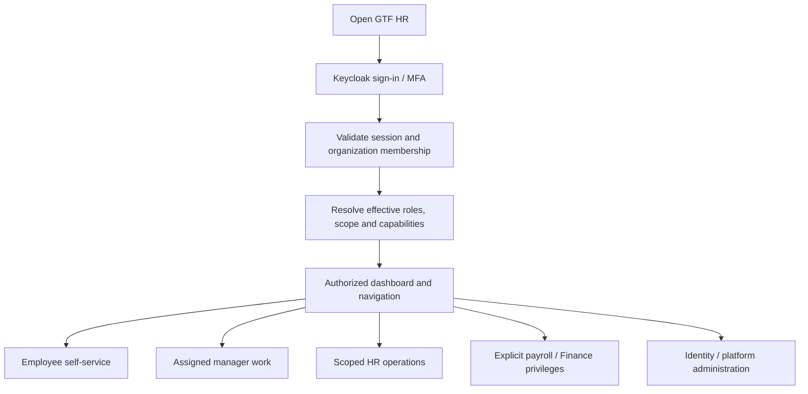

# User flows and role journeys

Status: implementation UX contract · Owner: Product + Design + domain owners · Updated: 2026-09-28

Every flow binds a user goal to authorization, screens, state transitions, recovery and evidence. [Roles and permissions](roles-permissions.md) owns rights; [API contract](api-contract.md) owns commands; [state management](state-management.md) owns frontend/server state. A visible button never grants permission.

## Entry and navigation

Failure routes: invalid login → generic error; expired session → sign-in; disabled membership → safe denial/support; missing resource or inaccessible record → non-disclosing not-found/denied treatment. Role changes take effect on the next protected request. Multi-role users see combined allowed navigation but cannot bypass self-approval rules by switching role views.

## UF-01 — employee views own records

Actor: employee, including managers/HR acting on their own employment. Routes: `/dashboard`, `/me/profile`, `/me/payslips`.

1. Resolve session-linked employment and permitted field projection on the server.
2. Stream independent dashboard sections under matching skeletons; show attendance/leave/tasks without exposing salary in global chrome.
3. Open profile or payslip page; the page reads authorized DTOs through `lib/api`.
4. Show published own documents only. Download rechecks current authorization, scan/publication state and expiry.
5. A profile change becomes a typed request or authorized direct change according to field policy; bank/legal changes use separate verification.

Recovery: no employee link → setup message; failed section → local error; unpublished payslip → empty state, not guessed amount. Evidence: T-01/T-03/T-06.

## UF-02 — attendance capture and regularization

Actor: employee; reviewer: assigned manager/HR under policy. Routes: `/attendance`, `/approvals`.

1. Display current authoritative day, shift/business date, capture availability and source freshness.
2. Employee selects check-in/out; request only approved evidence and explain permissions if needed.
3. Feature submits the supplied server action with stable command identity. Server derives employee identity and validates source/state.
4. Atomically record the raw event and audit/outbox; respond with durable reference, then update derived view.
5. Missing/incorrect punches show an exception. Employee submits a regularization with proposed times/reason.
6. Eligible nonself reviewer approves/rejects; approved correction links original events and recomputes unlocked inputs.
7. If payroll is frozen, generate an adjustment review; never rewrite the approved run.

Recovery: duplicate tap → original result; network response lost → confirmation pending and same-key reconciliation; denied location/offline → approved alternative regularization, not false attendance success. Evidence: T-07/T-08/T-30.

## UF-03 — leave request, decision and cancellation

Actor: employee; reviewer: effective manager/delegate/HR fallback. Routes: `/leave`, `/approvals`.

1. Read policy, calendar and available/reserved balances; show freshness and allowed leave types.
2. Employee selects dates/portions/reason; server computes chargeable units and policy treatment.
3. Submit a request. Server locks relevant balance rows, checks overlap/eligibility, reserves exact units and creates workflow atomically.
4. Show durable pending state/reference and the approval path. Notification delivery does not determine request success.
5. Reviewer opens assigned step, reads permitted context and approves/rejects with expected version; reject includes reason.
6. Approval consumes reservation; rejection releases it. Both decision and ledger effects commit once.
7. Cancellation before/after approval follows its policy/approval path and posts release/reversal once; payroll cut-off invokes adjustment handling.

Recovery: insufficient balance → inline conflict and refresh; competing decision → current state; missing approver → actionable HR configuration exception; employee cannot approve their own request through delegation. Evidence: T-09–11.

## UF-04 — HR creates/onboards/transfers an employee

Actor: scoped HR; supporting actor: IT for account provisioning. Routes: `/employees`, employee detail, `/onboarding`.

1. Confirm employee identity/code and joining/employment details; identify possible duplicates without automatic name-based merging.
2. Create scoped employment and effective department/location/manager/policy assignments.
3. Create owned onboarding tasks and permitted document requirements; uploads remain quarantined until scan success.
4. Link the verified identity account and issue approved invitation through the IdP workflow.
5. Finance independently verifies compensation/bank/statutory setup under payroll privileges.
6. For a transfer, choose effective date and preview affected scope/policies; retain historical assignments.
7. Employee signs in and sees only configured permitted data; HR monitors incomplete tasks.

Recovery: duplicate code/cycle/overlap → safe validation error; missing policy → explicit blocker; account without verified employee mapping cannot receive another person's records. Evidence: T-04/T-05/T-17/T-18.

## UF-05 — HR reviews imports and reports

Actor: domain-scoped HR/Finance import operator and authorized reviewer. Routes: import UI under administration, `/reports`.

1. Upload an approved template through the private file flow.
2. Worker parses into staging, normalizes safe values, validates mappings and records row errors without changing live data.
3. Operator resolves errors and compares counts/amounts against source; reviewer accepts the exact dry-run digest.
4. Commit once with checkpoints and deterministic external-ID mappings. Expose completion only after reconciliation.
5. For reporting, choose an authorized report/filter set and submit a job; UI shows progress/freshness and expiry.
6. Download rechecks current rights and source scope; revoked access or expired artifact fails safely.

Recovery: partial job → incomplete, never authoritative; retries deduplicate; export error files carry the same confidentiality as their source. Evidence: T-20/T-21/T-30.

## UF-06 — payroll operator prepares; Finance approves

Actors: payroll operator, different Finance approver, authorized publisher. Routes: `/payroll`, `/payroll/runs/[runId]`.

1. Select pay group/period and inspect cut-off readiness, missing inputs and unresolved HR exceptions.
2. Freeze input/rule versions and launch calculation worker; UI displays queued/running state and safe progress.
3. Review exact results and per-employee/component variance; failed/incomplete runs cannot enter review.
4. Submit the complete digest for independent approval. Operator cannot approve their own run even if also granted a Finance role.
5. Approver performs step-up, reviews period/count/net/rule/input evidence and approves or rejects the current version/digest.
6. Authorized publisher requests artifact generation/publication. Employees see payslips only after successful complete publication.
7. Finance creates the bank export, transmits through the approved external process, then reconciles acknowledgments per payment item.
8. Close with reconciled outcome or documented outstanding items; corrections are linked adjustments/new revisions, never edits to approved results.

Recovery: changed digest → redo review; PDF failure → idempotent artifact retry; missing bank acknowledgment → unresolved state, not paid; duplicate export → same settlement intent. Evidence: T-12–16 and Finance shadow cycles.

## UF-07 — exit and rehire

Actor: employee requests exit; HR owns lifecycle; IT revokes access; Finance owns settlement.

1. Record resignation/exit case, dates and required approval.
2. Assign notice, handover, document and asset tasks; collect evidence without automatic salary withholding.
3. Reconcile final attendance/leave and approved recoveries; Finance calculates/reviews final settlement.
4. Revoke membership, sessions, delegation and integration/device grants at the approved effective time.
5. Deliver required employee records through the approved secure exit channel with retention/hold rules.
6. On rehire, verify identity and create a new employment linked to existing person history; do not restore old privileges automatically.

Evidence: T-18 plus payroll settlement fixtures.

## UF-08 — administrator and auditor

IT admin manages identity/integrations/configuration under explicit capabilities, without default salary/document access. Privilege requests name scope, reason, validity and independent approver; changes invalidate effective permissions and are audited. Auditors receive time-limited read-only scope, review transition/access/export history and may export only with a separate capability. Emergency access is reason-bound, limited and independently reviewed. Evidence: T-01–03 and security review.

## UF-09 — later HR workflows

Helpdesk: employee creates categorized confidential ticket → scoped queue assignment → replies/evidence → resolution → closure. Expenses: draft/receipt → duplicate check → manager approval → Finance approval → single settlement → reconciliation. Performance: cycle/goals → self/manager drafts → controlled review/calibration → explicit release. Recruitment: restricted candidate/application → offer → verified hire conversion → onboarding. These reuse workflow, files, permissions, audit and notifications rather than independent rule implementations. Evidence: T-19/T-22–24.

## Shared interaction acceptance

Each step needs loading, empty, success, invalid input, unauthorized, stale conflict and dependency-failure behavior where applicable. Keep controls keyboard-accessible and focus predictable. State-changing requests must not succeed optimistically in the UI. Buttons/icons use accessible text or names; Iconsax never carries meaning by color alone. User-flow changes update the API, permission, state and frontend/backend task documents together.
